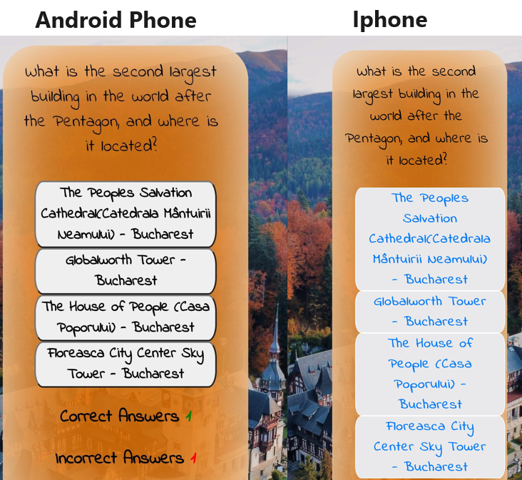
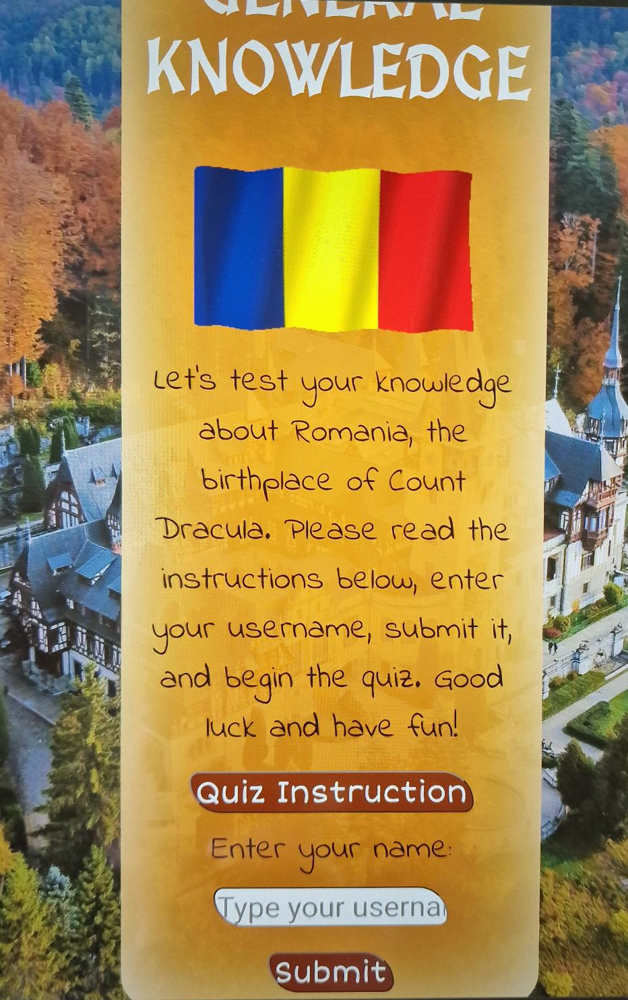
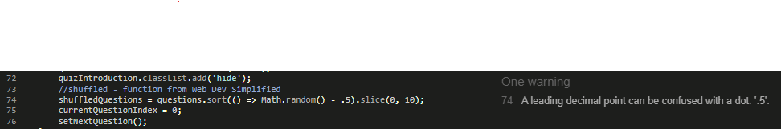
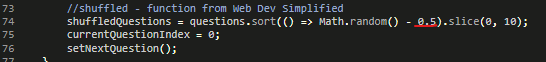
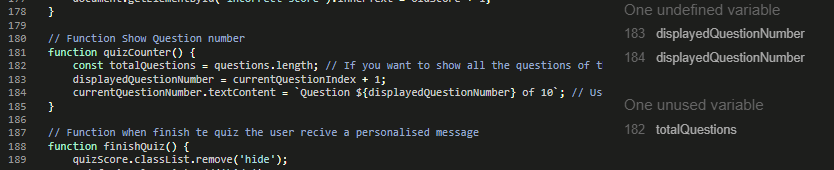
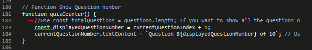
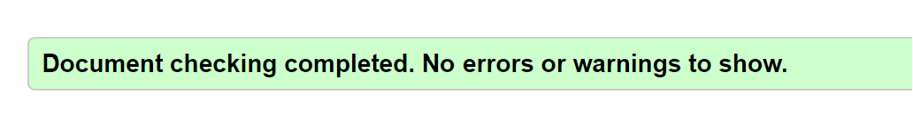
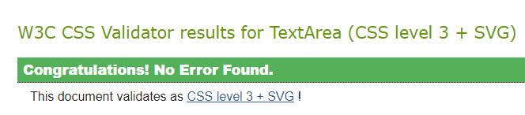
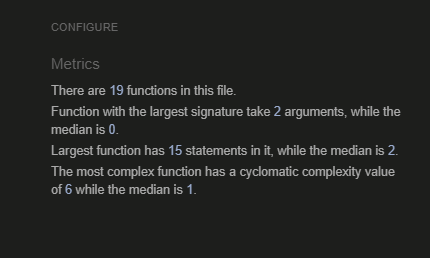

# DRACU QUIZ - ROMANIA GENERAL KNOWLEDGE

This is an online quiz about Romania. The questions have a moderate difficulty level and there is no time limit for answering them.

[Live Website] (<https://terintealexandrin18.github.io/quiz1romania/>)

[Github Repository] (<https://github.com/terintealexandrin18/quiz1romania>)

## Table of Contents

- User experience
  - Project Goal
  - User Stories
- Design
  - Page Layout
  - Color Scheme
  - Typography
- Features
  - Future Features
- Technologies
  - Languages Used
  - Frameworks, Libraries and Programs Used
- Testing
  - Bugs
    - Fixed Bugs
    - Unfixed bugs
  - Code Validation
  - Responsiveness
  - Accessibility
  - Compatibility
  - Manual Testing
- Function
- Deployment
- Credit
  - Content
  - Media
  - Code
- Acknowledgments

## 1 User Experience

### Project goal

- To create a quiz about Romania.
- The quiz should test the user's knowledge and provide results.
- To include questions that cover the most well-known information about Romania.
- To have the possibility to provide clear instructions.
- To avoid feeling time pressured while answering the question.
  
### User Stories

- A user is inquiring about the rules of the game.
- A user is requesting to know the final score of the quiz.
- A user wants to ensure that there is no time pressure while doing the quiz.
- A user desires to view both the correct and incorrect answers.

## 2 Design

### Page layout

- The quiz has a simple design that consists of a picture of Romania as the background with an orange element in the center as the body of the quiz. The website should have a basic appearance so that users can focus on the questions. The following contribute to the appearance of the page.

### Color Scheme

- Autumn is characterized by muted colors, but the right palette can create a cozy, welcoming interior. This color scheme, inspired by an autumnal background picture from Romania, adds vibrancy to the space.

### Typography

- The fonts were carefully selected to create a distinctive and playful medieval atmosphere that accurately represents Romania, a country abundant in castles and citadels. They also help to immerse the audience in the relevant period, making the content more engaging and immersive. The fonts enhance the overall experience and theme of the quiz.

- The fonts used in the quiz are:
  - 'MedievalSharp' for title.
  - 'Short Stack' for buttons.
  - 'Indie Flower' for the answers and body of the quiz.
  - 'Roboto' to be use in case the other fonts are not accesibile.

## 3 Features

- The quiz includes instructions that can be accessed by clicking on the "Quiz Instruction" button. The instructions can be hidden by clicking on "Close Instruction". This is optional for the user.
- The quiz requires users to enter their username, which will be used to generate a customized message when they finish the quiz.
- The quiz includes 20 questions in total, but only ten random questions will appear in the game.
- The score for correct and incorrect answers will be displayed under the questions, along with the progress.
- Once the user answers a question, the correct answer will be highlighted in green, while the incorrect answer will be in red.
- fter completing the quiz, the user can view their score and a customized message that depends on their performance.
- Users have the option to restart the quiz once it is over.

### Future Features

- Consider adding a few categories to the quiz, such as history, religion, and geography. It would make the quiz more diverse and exciting. It would make the quiz more diverse and interesting.
- Consider adding a leaderboard table.
- Add a "Hint" button that will eliminate two of the incorrect answers.
- Add trivia about the question and answer.

## 4 Technologies

### Languages Used

- [HTML5](https://en.wikipedia.org/wiki/HTML5) - For creating the base of the website.
- [CSS](https://en.wikipedia.org/wiki/CSS) - For adding style and color to webpage.
- [JAVASCRIPT](https://en.wikipedia.org/wiki/JavaScript) - For enhancing the functionality and interactivity of web pages to create a more engaging and user-friendly experience.

### Frameworks, Libraries and Programs Used

- [UNSPLASH](https://unsplash.com/) - Used for background picture.
- [FREEPIK](https://www.freepik.com/) - Used for favicon.
- [FUNTRIVIA](https://www.funtrivia.com/) - Used to get the quiz questions.
- [PROPROFS](https://www.proprofs.com/) - Used to get the quiz questions.
- [PIXABAY](https://pixabay.com/) - Used for gif Romanian flag.
- [GOOGLE FONTS](https://fonts.google.com/) - Used to import the fonts used in the entire website.
- [CODEANYWHERE](https://codeanywhere.com/) - Used for writing the code, committing and push it to GitHub.
- [GITHUB](https://github.com/) - Used to store the project after finishing writing in Codeanywhere.
- [I AM RESPONSIVE](https://ui.dev/amiresponsive) - Used to ensure that the design remained responsive throughout the process and to create mock-up images for use.
- [CHROME DEV TOOLS](https://developer.chrome.com/docs/devtools/) - Used to review the code, test its responsiveness, and make any necessary adjustments.
- [W3C MARKUP VALIDATOR](https://validator.w3.org/) - Used to validate the HTML code.
- [W3C CSS VALIDATOR](https://jigsaw.w3.org/css-validator/) - Used to validate the CSS code.
- [JSHINT](https://jshint.com/) - Used to validate the JAVASCRIPT code
- SNIPPING TOOL - Used for screenshot and snipping.
- PAINT - Used to combine the snipped images.

## 5 Testing

### Bugs 

- The quiz site was tested on various devices including laptop, tablet, and smartphones. The testing was done to ensure that the site was responsive and worked well on different screen sizes and resolutions. Different browsers were also used for testing to ensure cross-browser compatibility. The primary focus of the testing was to identify any bugs or issues with the site's functionality and user experience.
  
#### Fixed Bugs

  - Before completing the project, I identified and resolved the following issues.
  
|Issues occurred| Image with the issues|
|--|--|
|During the quiz, the buttons for selecting answers were not centered and the text color for iPhone was blue, while there was no issue on Android phones. However, the problem has been fixed by changing the answer text color to black. Additionally, the margins in the quiz body were too large, so I had to reduce them for smaller screens.||
|On the Android tablet and iPhone, the form placeholder was not visible, whereas on bigger screens and Android phones, this issue did not occur. I had to adjust the form's width to auto.|

|JavaScript Bugs|Image with the issue|Image with the issue fixed|
|--|--|--|
|A leading decimal point can be confused with a dot. The issue has been fixed by adding the decimal "0" to math random.|||
|Undefined variable and unused variable. To the undefined variable, "const" was added and the unused variable was commented out in the code.|||

#### Unfixed bugs

  - No unfixed Bugs.

### Code Validation

- The entire website has been validated, and no issues have been found.

|Programming language| Pass/Fail| Result|
|--|--|--|
|HTML|✓||
|CSS|✓||
|JAVASCRIPT|✓||

### Accessibility

|Lighthouse in Chrome DevTools.|Score|
|--|--|
|Lighthouse Report||

### Compatibility

- Browser Compatibility. The website has been tested on the following browsers:

|Name of the Browser|Compatible ✓ / Incompatible ✕ |
|--|--|
|Safari|✓ |
|Firefox| ✓|
|Google Chrome|✓ |
|Interner Explorer| ✓|

Device Compatibility. The website has been tested on the following devices:
|Name of the Device|Compatible ✓ / Incompatible ✕ |
|--|--|
|IPhone 8 Plus|✓ |
|IPhone 13 Pro Max| ✓|
|Samsung Galaxy S10 Plus|✓ |
|Samsung Galaxy S22 Ultra 5G | ✓|
|Samsung Galaxy Tab A7 | ✓|
|Microsoft Surface Pro X | ✓|

### Manual Testing 
 
 Signs for pass the test: ✓
 Sign for failed the test: ✕

|The following devices were used to test these elements:| Iphone 8 | Iphone 13 Pro Max | Samsung S10 Plus | Samsung Galaxy S22 Ultra 5G |Samsung Galaxy Tab A7 | Microsoft Surface Pro X |
| --| -- | -- | --| -- | -- | -- |
|Buttn  "Quiz Instruction"|✓|✓|✓|✓|✓|✓|
|Button "Close Instruction"|✓|✓|✓|✓|✓|✓|
|Button "Submit" without a name - Error message showing |✓|✓|✓|✓|✓|✓|
|Button "Submit" with a name - Error message disappears|✓|✓|✓|✓|✓|✓|
|Username apears with the button "Start"|✓|✓|✓|✓|✓|✓|
|Questions Visible|✓|✓|✓|✓|✓|✓|
|Animation for showing the questions - large screens only| N/A|N/A|N/A|N/A|✓|✓|
|All four answer buttons visible|✓|✓|✓|✓|✓|✓|
|Showing the qustion number|✓|✓|✓|✓|✓|✓|
|Button "Next" changing the questions and rest the answers button background color|✓|✓|✓|✓|✓|✓|
|Incrementing correct/incorrect answers|✓|✓|✓|✓|✓|✓|
|The correct answer button background turns green and the incorrect answers background will turn red|✓|✓|✓|✓|✓|✓|
|After answering the last question, a customized message will appear after 6 seconds|✓|✓|✓|✓|✓|✓|
|Username is included in the customized message|✓|✓|✓|✓|✓|✓|
|For scores of 9 and 10 points, the message "You have amazing knowledge..." will be displayed|✓|✓|✓|✓|✓|✓|
For scores of 7 and 8 points, the message "You have good knowledge..." will be displayed|✓|✓|✓|✓|✓|✓|
For scores of 5 and 6 points, the message "You have basic knowledge..." will be displayed|✓|✓|✓|✓|✓|✓|
For scores of 0 and 4 points, the message "You didn't pass the basic..." will be displayed|✓|✓|✓|✓|✓|✓|
|Button "Restart"|✓|✓|✓|✓|✓|✓|

## Function

