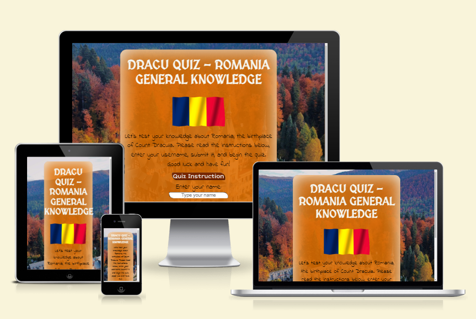
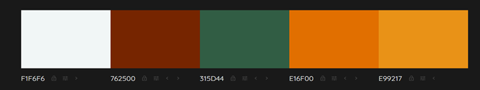

# DRACU QUIZ - ROMANIA GENERAL KNOWLEDGE

 This is an online quiz about Romania. The questions have a moderate difficulty level and there is no time limit for answering them.

[Live Website] (<https://terintealexandrin18.github.io/quiz1romania/>) 
[Github Repository] (<https://github.com/terintealexandrin18/quiz1romania>)

## Table of Contents

- User experience
  - Project Goal
  - User Stories
- Design
  - Page Layout
  - Color Scheme
  - Typography
- Features
  - Future Features
- Technologies
  - Languages Used
  - Frameworks, Libraries and Programs Used
- Testing
  - Code Validation
  - Responsiveness
  - Accessibility
  - Compatibility
  - Tools Testing
  - Manual Testing
- Function
- Deployment
- Credit
  - Content
  - Media
  - Code
- Acknowledgments

## 1 User Experience
### Project goal

- To create a quiz about Romania.
- The quiz should test the user's knowledge and provide results.
- To include questions that cover the most well-known information about Romania.
- To have the possibility to provide clear instructions.
- To avoid feeling time pressured while answering the question.
  

### User Stories

- A user is inquiring about the rules of the game.
- A user is requesting to know the final score of the quiz.
- A user wants to ensure that there is no time pressure while doing the quiz.
- A user desires to view both the correct and incorrect answers.

## 2 Design
### Page layout

- The quiz has a simple design that consists of a picture of Romania as the background with an orange element in the center as the body of the quiz. The website should have a basic appearance so that users can focus on the questions. The following contribute to the appearance of the page.

### Color Scheme

- Autumn is characterized by muted colors, but the right palette can create a cozy, welcoming interior. This color scheme, inspired by an autumnal background picture from Romania, adds vibrancy to the space.

### Typography

- The fonts were carefully selected to create a distinctive and playful medieval atmosphere that accurately represents Romania, a country abundant in castles and citadels. They also help to immerse the audience in the relevant period, making the content more engaging and immersive. The fonts enhance the overall experience and theme of the quiz.

- The fonts used in the quiz are:
  - 'MedievalSharp' for title.
  - 'Short Stack' for buttons.
  - 'Indie Flower' for the answers and body of the quiz.

### Responsiveness
